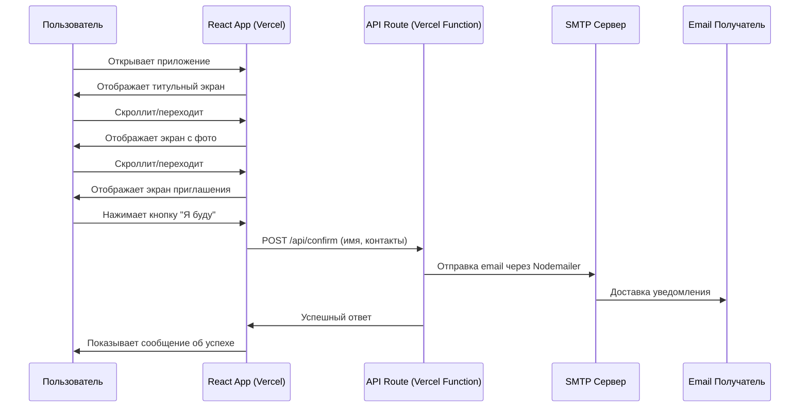
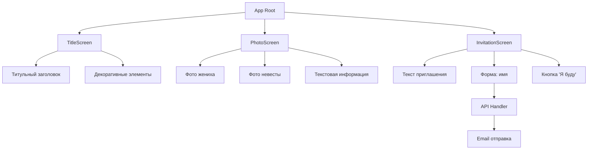

# Технический стек и архитектура веб-приложения свадебного приглашения

## Технический стек

### Frontend

- **React** (или **Next.js** для SSR/SSG) - для создания UI компонентов
- **React Router** (или встроенный роутинг Next.js) - навигация между экранами
- **CSS Modules / Styled Components / Tailwind CSS** - стилизация, мобильная адаптация
- **Framer Motion** (опционально) - плавные анимации переходов между экранами

### Backend/API

- **Next.js API Routes** (если используем Next.js) или **Vercel Serverless Functions** - обработка отправки email
- **Nodemailer** - библиотека для отправки email через SMTP
- **dotenv** - управление переменными окружения (SMTP credentials)

### Инфраструктура

- **Vercel** - хостинг фронтенда и серверных функций
- **Environment Variables** в Vercel - хранение SMTP настроек и email получателя

### Дополнительные инструменты

- **Git** - версионирование кода
- **TypeScript** (рекомендуется) - типизация для надежности

## Архитектура системы

### Взаимодействие сервисов

### Архитектура компонентов

### Поток данных

1. **Загрузка приложения**: Статические страницы загружаются с Vercel CDN
2. **Навигация**: Переход между экранами через scroll или кнопки (single-page application)
3. **Подтверждение присутствия**:

   - Пользователь вводит имя (опционально контакты)
   - Нажатие кнопки инициирует POST запрос к API endpoint
   - Serverless функция обрабатывает запрос
   - Nodemailer отправляет email через SMTP
   - Ответ клиенту с результатом операции

### Конфигурация окружения

Приложение требует настройки переменных окружения для работы SMTP:

- SMTP сервер (host и port)
- Учетные данные SMTP (пользователь и пароль приложения)
- Email адрес получателя уведомлений о подтверждении

Эти параметры хранятся в Environment Variables платформы Vercel для безопасности

## Особенности реализации

### Мобильная версия

- Viewport meta tag для корректного отображения
- Touch-friendly интерфейс (большие кнопки, достаточные отступы)
- Вертикальная прокрутка или swipe-навигация между экранами
- Адаптивная типографика (rem/vw единицы)

### Оптимизация

- Lazy loading изображений
- Минификация CSS/JS при деплое
- CDN для статических ресурсов через Vercel
- Оптимизация изображений (WebP формат)

### Безопасность

- Rate limiting для API endpoint (защита от спама)
- Валидация входных данных на клиенте и сервере
- CORS настройки для API
- HTTPS (автоматически на Vercel)

## Сроки разработки

### Вариант 1: Минимальный MVP (базовый функционал)

- **Frontend (3 экрана)**: 4-6 часов
- **API endpoint + Email интеграция**: 2-3 часа
- **Стилизация и адаптация**: 3-4 часа
- **Тестирование и деплой**: 1-2 часа
- **ИТОГО**: ~10-15 часов (1.5-2 рабочих дня)

### Вариант 2: С анимациями и улучшенным дизайном

- **Frontend с анимациями**: 8-10 часов
- **API + Email**: 2-3 часа
- **Продвинутая стилизация**: 5-6 часов
- **Тестирование и полировка**: 2-3 часа
- **ИТОГО**: ~17-22 часа (2.5-3 рабочих дня)

### Разбивка по этапам:

1. **Этап 1**: Настройка проекта, структура (1-2 часа)
2. **Этап 2**: Базовые компоненты 3 экранов (3-4 часа)
3. **Этап 3**: API endpoint и SMTP интеграция (2-3 часа)
4. **Этап 4**: Стилизация и мобильная адаптация (4-6 часов)
5. **Этап 5**: Анимации и UX улучшения (опционально, 3-4 часа)
6. **Этап 6**: Тестирование и деплой (1-2 часа)

## Рекомендации

1. **Использовать Next.js** вместо чистого React для упрощения деплоя на Vercel и встроенной поддержки API routes
2. **Детские фотографии** размещать в директории для статических файлов и использовать оптимизированные компоненты для работы с изображениями
3. **Email шаблон** сделать красивым HTML письмом с информацией о подтверждении
4. **Аналитика** (опционально): добавить Google Analytics для отслеживания просмотров
5. **Backup вариант**: если SMTP нестабилен, рассмотреть SendGrid/Mailgun для production

## Дополнительные возможности (будущее развитие)

- Форма сбора контактов (телефон, email гостя)
- Счетчик подтверждений на главной странице
- Возможность оставить пожелания/сообщения
- Календарь события с автоматическим добавлением в календарь гостя
- Информация о месте проведения (карта, адрес)
